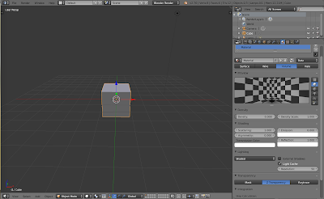
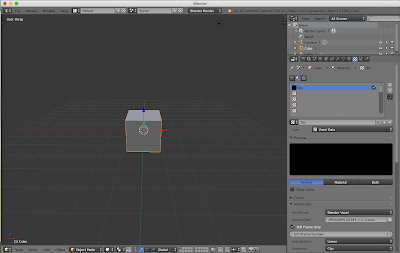
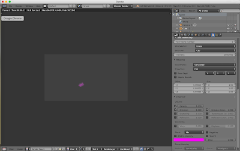
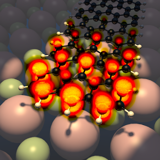

In this post, we are going to import the grid data from a [Gaussian cube file](http://paulbourke.net/dataformats/cube/) into [Blender](https://www.blender.org/), an open-source 3d graphics software.

<!--truncate-->

Why this effort? In the atomistic simulations community, we are used to displaying wave functions and electron densities as isosurfaces and lots of software exists that makes this process very easy. But an isosurface doesn't tell the whole story. Blender gives us the opportunity to visualize the electron density as a kind of "smoke cloud", where the density determines how light scatters going through the cloud (we may then add an intrinsic glow to the cloud as well). While this is not needed in the daily routine of understanding the basic features of an electron distribution, it allows to convey the inherent fuzzyness in a single image.

Of course, there is many more reasons, why one may want to use Blender. Among its many features, some of the ones relevant to atomistic simulations are

 1. a great graphical user interface[^1]
ray-tracing capabilities
 1. advanced animation capabilities (including physics!)
 1. a Python interface that allows for automating workflows

However, Blender was originally developed for animation studios, and so the import of file formats customary in atomistic simulations is not always straightforward.

For atomic structure data, several routes are already available

 * The [XYZ addon](https://wiki.blender.org/index.php/Extensions:2.6/Py/Scripts/Import-Export/XYZ) for directly importing XYZ (.xyz) files into Blender
 * Via [VMD](http://www.ks.uiuc.edu/Research/vmd/), exporting to the Wavefront Objects (.obj/.mtl), which can be imported by Blender
  This allows not only to import atomic structure models, but also isosurfaces etc.
 * Via [ASE](https://wiki.fysik.dtu.dk/ase/), exporting to the X3D (.x3d) format, which can be imported by Blender

But how would we go about importing a function f(x,y,z) defined on a regular 3d grid, such as an orbital wave function or electron density? In this post, we are going to import the grid data from a Gaussian cube file.

First, we have to note that the capability to render this kind data (called "[voxels](https://en.wikipedia.org/wiki/Voxel)" in the Blender community) is currently [available only for the internal "Blender Render"](https://developer.blender.org/T41179) engine. While the "Cycles Render" engine is being used and developed more actively, we will have to abandon it for now. "Blender Internal" offers two alternative file formats for importing voxel data
 * "8bit raw", in which f(x,y,z) is stored as integers ranging from 0 to 255
 * "Blender voxel", in which f(x,y,z) is stored as 32bit floats. 

The first format is basically unusable for wave functions/densities of molecules - a relative accuracy of 1/256 doesn't get you very far when sampling exponential decays. We thus choose the latter format.

So, we need to convert the .cube file into a .bvox file. Adapting [a post by Matthias Meschede](http://pythology.blogspot.co.uk/2014/08/you-can-do-cool-stuff-with-manual.html), this is easily achieved using a combination of ASE and numpy: 

```python
#!/usr/bin/env python
import ase.io.cube
import numpy as np
import os

fname = 'PROJ-WFN_00183_1-1_0.cube'
print("Reading cube file {}".format(fname))
data, atoms = ase.io.cube.read_cube_data(fname)

# Here, I want the electron density, not the wave function
data = data**2

# If data is too large, just reduce it by striding with steps >1
sx, sy, sz = 1, 1, 1
data = data[::sx,::sy,::sz]

# Note the reversed order!!
nz, ny, nx = data.shape
nframes = 1
header = np.array([nx,ny,nz,nframes])

#open and write to file
vdata = data.flatten() / np.max(data)
vfname = os.path.splitext(fname)[0] + '.bvox'
vfile = open(vfname,'wb')
print("Writing Blender voxel file {}".format(vfname))
header.astype('<i4').tofile(vfile)
vdata.astype('<f4').tofile(vfile)
```


Now we need to load the file into Blender. The steps are essentially the following


 1. Open Blender and select "Blender Render"
 1. Select the default cube, set its material to "Volume" and its "Density" to 0
    
 1. Add a new texture of type "Voxel Data", file format "Blender Voxel" and load the file
   Note: You don't get any confirmation of the file being loaded but if you don't get an error message, assume that it is.
 1. Activate "Still frame" and set still frame number to 1 (not 0!)
    
 1. Activate influence on density and emission and ramp up the intensity until you see something in the rendered output. Note: You may never see anything in the preview window - don't let this confuse you. should be able to continue by yourself and unleash your creativity on the voxels!
    

To give you one possible idea of what can be done, here is what I came up with for my first Blender project

  
*End state of N=7 armchair graphene nanoribbon*


Cheers!


[^1]: This may sound trivial, but alternatives, such as POV-ray may have no gui whatsoever.

